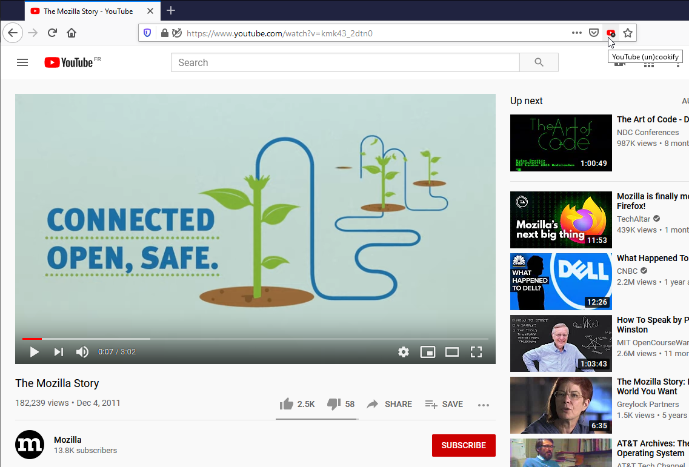
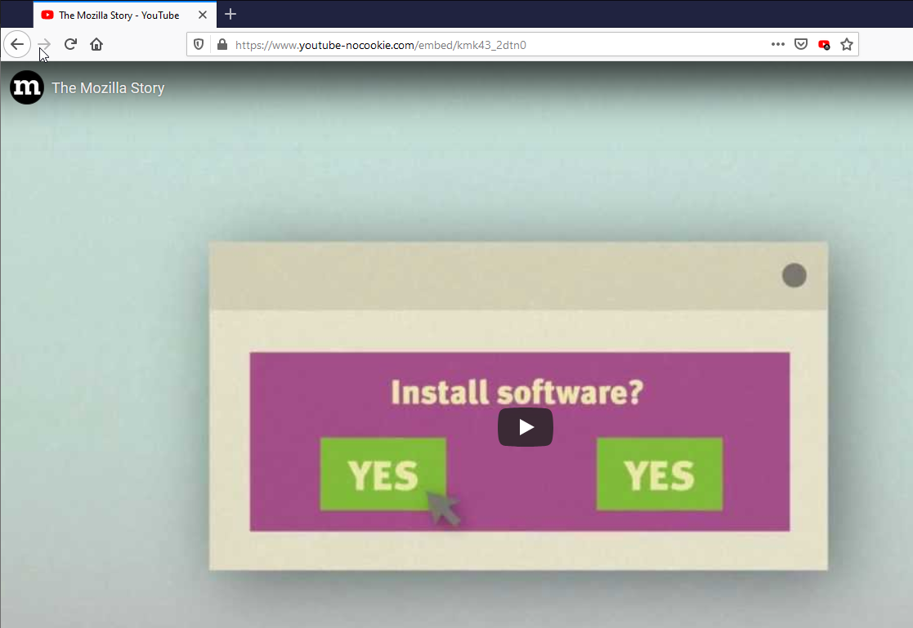
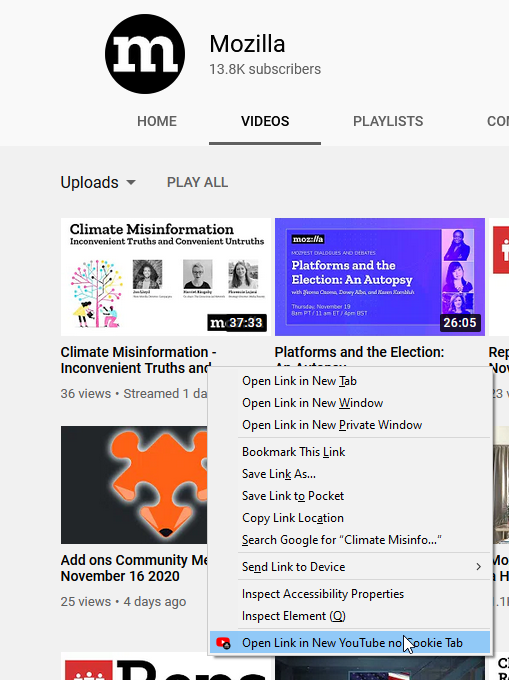

# YouTube (un)cookify

Quickly switch context to watch YouTube video without impacting your watch history!

Using this extension, you'll be able to easily watch YouTube videos without impacting your watch history. Plus, no more sign in and agreement pop ups ;)

Simply click on the YouTube (un)cookify button on any YouTube watch page to switch that page to YouTube enhanced privacy website (youtube-nocookify.com).

The button can be middle-clicked to open a new tab.

You can also open YouTube video links directly in a new tab from the context menu.  
